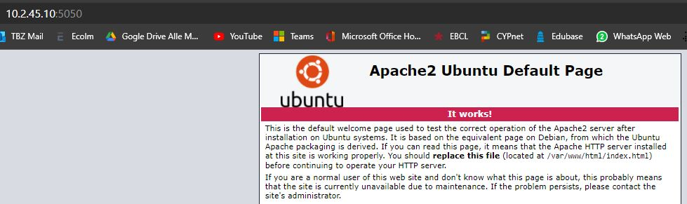
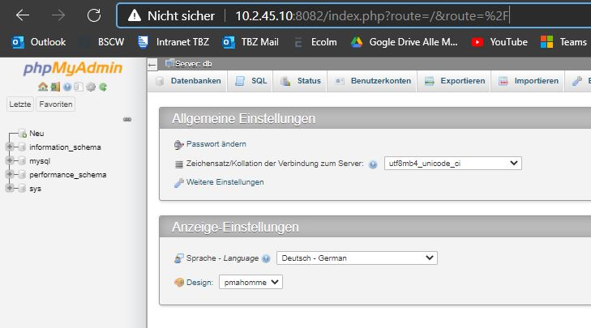
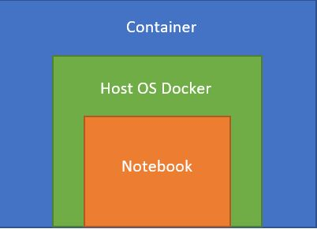
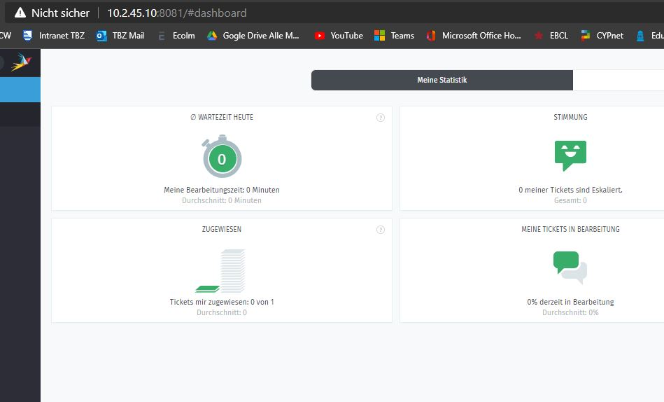
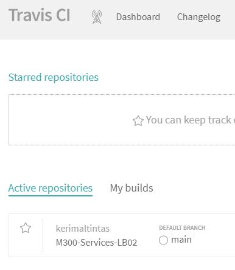

# M300-Services-LB02

## Einleitung

In meinem Markdown halte ich fest, was ich neues im Modul 300 gelernt habe und wie ich die vorgegebenen Aufgaben gelöst habe. Dies bedeutet aber auch, dass dies auch Fehlerbehebungen oder Umwege beinhaltet um zur optimalen Lösung zu kommen.

## Inhaltsverzeichnis

* [30 Container](#30-Container)
* [35 Sicherheit](#35-Sicherheit)
* [80 Ergänzungen zu den Unterlagen](#80-ergänzungen-zu-den-unterlagen)

## 30 Container
### Was versteht man unter Containisierung?
Bei der Containerisierung handelt es sich um eine Art Virtualisierung auf Anwendungsebene, bei der mehrere isolierte Userspace-Instanzen auf einem einzelnen Kernel ausgeführt werden können. Diese Instanzen werden Container genannt.

### Welche Vorteile bringt es mit sich?
#### Resourcenbedarf 
* Container benötigen auf dem Server weniger Ressourcen als virtuelle Maschinen und sind normalerweise innerhalb weniger Sekunden gestartet.
#### Elastizität
 * Container sind hochelastisch und müssen nicht mit einer bestimmten Menge an Ressourcen ausgestattet werden. Dies bedeutet, dass Container die Ressourcen des Servers effizienter und dynamischer nutzen können.
#### Performance 
* Bei hohen, konkurrierenden Ressourcenanforderungen ist die Leistung von Anwendungen  die aus einer Containerumgebung ausgeführt werden weitaus besser als bei der Ausführung in einer virtuellen Maschine.


### 01 Docker 
Docker ist eine Freie Software zur Isolierung von Anwendungen mit Hilfe von Containervirtualisierung. Docker vereinfacht die Bereitstellung von Anwendungen, weil sich Container, die alle nötigen Pakete enthalten, leicht als Dateien transportieren und installieren lassen. Container gewährleisten die Trennung und Verwaltung der auf einem Rechner genutzten Ressourcen. 


### 02 Virtuelle Maschine vs Docker

Wie man gut erkennen kann, geht es hier um den Vergleich zwischen virtuellen Maschinen und Containern. Beide haben ihre Vor und Nachteile. Doch für die minimierung der weniger wichtigen Ressourcen ist Docker sehr gut geeignet. In diesem Beispiel hat auf der virtuellen Maschine Seite jede App ein eigenes Betriebssystem. Dies ist bei Containiesierung (Docker) nicht der Fall. Da wird das Betriebssystem von unserem Dockerbereitgestellt und die Apps teilen sich dies.


### 03 Webserver einrichten
* Zuerst muss das Image erstellt werden. Mit docker build.


* Anschliessend wird der Port 5050 konfiguriert für den Webserver.


* Nun kann man mit docker ps überprüfen ob dieses Image iene Container ID bekommen hat und ob der Port eingetragen ist.


* Zum Schluss kann man mit der eigenen IP und dem richtigen Port überprüfen ob der Webserver erreichbar ist. 


Nun konnte man den Webserver noch weiter ausbauen. Damit man direkt eine Apache anzeige bekommt. Dafür musste man ein Apache Volume Repository erstellen. Anschliessend im File den Apacheteil hinzufügen und konnte mit einem einfachen Schritt das Volume erfolgreich implementieren. 

Der Befehl den ich dafür gebraucht habe war:

````
$ docker run -dit --name apachevolume -p 5050:80 apachevolume
````

Danach konnte man wie auch beim Webserver mit dem konfigurierten Port 5050 auf den Apache zugreifen. 


### 06 Bestehende Container kombinieren

Hier war es die Aufgabe bestehende zwei Container zu kombinieren. Dafür habe ich mysql als Datenbank verwendet undmyphpadmin als frontend. Ich brauchte folgende Befehle um diese Aufgabe erfolgreich zu bearbeiten.

````
$ docker pull mysql:8.0.1
````
````
$ ocker run --name my-own-mysql -e MYSQL_ROOT_PASSWORD=mypass123 -d mysql:8.0.1
````
````
$ docker pull phpmyadmin/phpmyadmin:latest
````
````
$ docker run --name my-own-phpmyadmin -d --link my-own-mysql:db -p 8082:80 phpmyadmin/phpmyadmin
````

Zuerst hatte ich Problemem mit dem Erreichen der phpmyadmin Site und fragte mich wieso dies nicht ging. Erst später fiel mir auf das ich den Port 8081 bereits im Benutzung hatte und auf den Port 8082 wechseln musste. 

So konnte ich in meinem Browser mit 10.2.45.10:8082 die Seite erreichen. Hier braucht man allerdings noch ein Login um die Seite nutzen zu können.

Zum Schluss kann man mit der eigenen IP und dem richtigen Port überprüfen ob der Webserver erreichbar ist. 

* Username: root
* Password: mypass123

Folgendermassen schaute die Seite aus:


### 05 Docker Befehle
| Befehl            | Funktion                                             |
| -------------     | ---------------------------------------------------- | 
| ```docker pull```     | Holt ein Image. |
| ```docker run```      | Started VM mit dem ausgewähltem Image. |
| ```docker ps```       | Zeigt laufende Maschinen. |
| ```docker version```  | Zeigt die Docker Version von Echo-Client und Server an. |
| ```docker images```   | Listet alle Docker Images auf. |
| ```docker exec```     | Führt einen Befehl in einem laufenden Container aus. |
| ```docker search```   | Durchsucht das Docker Hub nach Images. |
| ```docker attach```   | Hängt etwas an einen laufenden Container an. |
| ```docker commit```   | Erstellt ein neues Image mit den Änderungen, die an einem Container vorgenommen worden sind. |
| ```docker stop```     | Haltet die gewünschte Maschine an. |

### 05 Netzwerkplan


### 06 Schichtenmodell



## 35 Sicherheit
Sowie das Überwachen und auch das Protokollieren von laufenden Containern ist sehr wichtig. Zum Beispiel bei den Microservices ist es wegen der höheren Zahl von Rechnern noch wichtiger.

### 01 Monitoring 
* Nun geht es darum das ein Monitoring eingerichtet wird. Hierfür verwende ich den Port 8080. Das Image wird gefunden und eine Container ID wird dementsprechend verpasst. 


* Nun kann man wieder überprüfen ob die Container ID und der Por eingetrgaen wurden unter docker ps.


* Zum Schluss kann man dann mit dem ausgewählte Port bei mir wäre dies jetzt 8080, auf die Seite via Browser zugegriffen werden. 


### 02 Logging

Die Logs können über den Befehl docker logs abgerufen werden. Es gibt mehrere Werte, die man über das Argument von docker auswählen kann:

* json-file 

Ausgaben abholen:
````
$ docker run --name logtest ubuntu bash -c 'echo "stdout"; echo "stderr" >>2'
$ docker logs logtest
$ docker rm logtest
````
Laufende Ausgaben:
````
$ docker run -d --name streamtest ubuntu bash -c 'while true; do echo "tick"; sleep 1; done;'
$ docker logs streamtest
$ docker logs streamtest | wc -l
$ docker rm streamtest
````

Protokollierung in das System-Log des Hosts:
````
$ docker run -d --log-driver=syslog ubuntu bash -c 'i=0; while true; do i=$((i+1)); echo "docker $i"; sleep 1; done;'
$ tail -f /var/log/syslog
````

### 03 Weitere Sicherheitstipps

Hier sind noch weitere Sicherheitstipps welche einem bei einer Verbesserung oder Verschäfung der Sicherheit helfen könnten.


* CPU beschränken
````
$ docker run -d --name load3 -c 512 amouat/stress
````
* Neustarts begrenzen
````
$ docker run -d --restart=on-failure:10 my-flaky-image
````
* Zugriffe aus Dateisysteme begrenzen
````
$ docker run --read-only ubuntu touch x
````


## 80 Ergänzungen zu den Unterlagen

### 01 Ticketsystem

Herr Kälin hat uns einen super Vorschlag gemacht, mit dem Implementieren eines Ticketsystems im umsere Umgebung. So sind wir als Gruppe zusammengessen und haben daran gebastelt. Wir haben uns für das Ticketsystem von Zammad entschieden. Dies aus einem einfachen Grund. Es bietet eine gute Grundlage und ist nicht komplex aufgebaut. Nach einem kurzen Einlesen sollte man Bescheid wissen wie man ein Ticket erstellen kann. Auch hat man einen Account auf den verschiedene Tickets zugewiesen werden können sowie auch Statistiken wie viele Tickets abgearbeitet wurden. 

Ein wichtiger Grundbefehl um das Ticketsystem zum Laufen zu bringen wäre dieser hier. 

````
$ docker container run -ti --rm --name zammad -p 80:80 zammad/zammad
````
Wie man sieht habe ich das Ticketsystem über meine Server IP mit dem konfigurierten Port 8081 erreicht. 




### 02 Gescheiterte Aufgabe

Ich wollte noch mit einer yamml Datei eine Cloud-Lösung versuchen mit in mein LB02 zu implementieren. Dafür konnte ich Travis Cl benutzen. Ich habe mein Repository in das Travis Cl geklont und es auch mit den richtigen Befehlen bearbeitet. 



Nun musste ich manuell ein .yamml File generieren und darin folgende Code in Datei setzen:
````
$ git: clone: false
````
Nun mussten noch kleine Befehle abgearbeitet werden. Trotzdem kam keine Antwort der Webseite und denn fehlenden Beitrag. Unter My Builds sollte ich weitere Ausgabe haben. Doch es kam keine,auch nach Tagen an dem zu arbeiten, leider gab es keinen Eintrag uter My Builds. 


### 03 Testing

| Testfall     |    Funktionsfähigkeit   |
| ------------- |:-------------:|
| Container starten lassen       |    Funktioniert  | 
| Von Client aus auf http://10.2.45.10:8082/ (phpmyadmin) | Funktioniert
| Mit root & Passwort anmelden | Funktioniert
| Webserver mit Apache erreichbar | Funktioniert


### 04 Vergleich Vorwissen - Wissenszuwachs

Zuvor hatte ich ziemlich wenig Kenntnisse zum ganze Containerthema. Ich hatte einen üK zur Virtualisierung kurz vor dem Modul beginn abgeschlosssen und dort hatten wir das Thema Container ein wenig behandelt. 

Nun weiss ich wofür Container benutzt werden und wieso sie von Vorteil sind. Allerdings denke ich umd dies in einer Firma implementieren zu können braucht es Spezialisten die sich damit auskennen oder man beauftragt eine externe Firma dafür die Spezialisten zur Verfügung hat. Das Modul insbesondere die Lb02 hat mir sehr geholfen die ganze Virtualisierung besser zu verstehen und ich denke dies kann mir un Zukunft sehr viel weiterhelfen. Ich habe dazu gelernt wie man Container anwendet und die gewünschten Tools wie ein Ticketsystem laufen lässt. 

### 05 Reflexion

Am Ende dieses Moduls kann ich behaupten das ich die Thematik dahinter verstanden habe. Auch wenn ich Statschwierigkeiten hatte mit gewissen Aufgaben, nahm ich mir die Zeit und versuchte sie wirklich zu verstehen. Ich hatte das Gefühl das man bei dieser LB02 wirklich das Thema verstanden haben muss um es umsetzen zu können in der Praxis. Ein eher komplexes und neues Thema welches hier behandelt wurde, doch sehr hilfreich um die Zukunft der Informatik besser nachvollziehen zu können.
