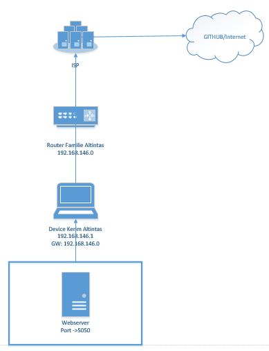

# M300-Services-LB02

## 30 Container
### Was versteht man unter Containisierung?
Bei der Containerisierung handelt es sich um eine Art Virtualisierung auf Anwendungsebene, bei der mehrere isolierte Userspace-Instanzen auf einem einzelnen Kernel ausgeführt werden können. Diese Instanzen werden Container genannt.

### Welche Vorteile bringt es mit sich?
#### Resourcenbedarf 
* Container benötigen auf dem Server weniger Ressourcen als virtuelle Maschinen und sind normalerweise innerhalb weniger Sekunden gestartet.
#### Elastizität
 * Container sind hochelastisch und müssen nicht mit einer bestimmten Menge an Ressourcen ausgestattet werden. Dies bedeutet, dass Container die Ressourcen des Servers effizienter und dynamischer nutzen können.
#### Performance 
* Bei hohen, konkurrierenden Ressourcenanforderungen ist die Leistung von Anwendungen  die aus einer Containerumgebung ausgeführt werden weitaus besser als bei der Ausführung in einer virtuellen Maschine.


### 01 Docker 
Docker ist eine Freie Software zur Isolierung von Anwendungen mit Hilfe von Containervirtualisierung. Docker vereinfacht die Bereitstellung von Anwendungen, weil sich Container, die alle nötigen Pakete enthalten, leicht als Dateien transportieren und installieren lassen. Container gewährleisten die Trennung und Verwaltung der auf einem Rechner genutzten Ressourcen. 


### 02 Virtuelle Maschine vs Docker

Wie man gut erkennen kann, geht es hier um den Vergleich zwischen virtuellen Maschinen und Containern. Beide haben ihre Vor und Nachteile. Doch für die minimierung der weniger wichtigen Ressourcen ist Docker sehr gut geeignet. In diesem Beispiel hat auf der virtuellen Maschine Seite jede App ein eigenes Betriebssystem. Dies ist bei Containiesierung (Docker) nicht der Fall. Da wird das Betriebssystem von unserem Dockerbereitgestellt und die Apps teilen sich dies.


### 03 Webserver einrichten
Zuerst muss das Image erstellt werden. Mit docker build.


Anschliessend wird der Port 5050 konfiguriert für den Webserver.


Nun kann man mit docker ps überprüfen ob dieses Image iene Container ID bekommen hat und ob der Port eingetragen ist.


Zum Schluss kann man mit der eigenen IP und dem richtigen Port überprüfen ob der Webserver erreichbar ist. 


### 04 Docker Befehle
| Befehl            | Funktion                                             |
| -------------     | ---------------------------------------------------- | 
| ```docker pull```     | Holt ein Image. |
| ```docker run```      | Started VM mit dem ausgewähltem Image. |
| ```docker ps```       | Zeigt laufende Maschinen. |
| ```docker version```  | Zeigt die Docker Version von Echo-Client und Server an. |
| ```docker images```   | Listet alle Docker Images auf. |
| ```docker exec```     | Führt einen Befehl in einem laufenden Container aus. |
| ```docker search```   | Durchsucht das Docker Hub nach Images. |
| ```docker attach```   | Hängt etwas an einen laufenden Container an. |
| ```docker commit```   | Erstellt ein neues Image mit den Änderungen, die an einem Container vorgenommen worden sind. |
| ```docker stop```     | Haltet die gewünschte Maschine an. |

### 05 Netzwerkplan




## 35 Sicherheit

### 01 Monitoring 
Nun geht es darum das ein Monitoring eingerichtet wird. Hierfür verwende ich den Port 8080. Das Image wird gefunden und eine Container ID wird dementsprechend verpasst. 


Nun kann man wieder überprüfen ob die Container ID und der Por eingetrgaen wurden unter docker ps.


Zum Schluss kann man dann mit dem ausgewählte Port bei mir wäre dies jetzt 8080, auf die Seite via Browser zugegriffen werden. 


## 40 Kubernetes (k8s)

## 80 Ergänzungen zu den Unterlagen

### Vergleich Vorwissen - Wissenszuwachs

Zuvor hatte ich ziemlich wenig Kenntnisse zum ganze Containerthema. Ich hatte einen üK zur Virtualisierung kurz vor dem Modul beginn abgeschlosssen und dort hatten wir das Thema Container ein wenig behandelt. 

Nun weiss ich wofür Container benutzt werden und wieso sie von Vorteil sind. Allerdings denke ich umd dies in einer Firma implementieren zu können braucht es Spezialisten die sich damit auskennen oder man beauftragt eine externe Firma dafür die Spezialisten zur Verfügung hat. Das Modul insbesondere die Lb02 hat mir sehr geholfen die ganze Virtualisierung besser zu verstehen und ich denke dies kann mir un Zukunft sehr viel weiterhelfen. Ich habe dazu gelernt wie man Container anwendet und die gewünschten Tools wie ein Ticketsystem laufen lässt. 

### Reflexion

Am Ende dieses Moduls kann ich behaupten das ich die Thematik dahinter verstanden habe. Auch wenn ich Statschwierigkeiten hatte mit gewissen Aufgaben, nahm ich mir die Zeit und versuchte sie wirklich zu verstehen. Ich hatte das Gefühl das man bei dieser LB02 wirklich das Thema verstanden haben muss um es umsetzen zu können in der Praxis. Ein eher komplexes und neues Thema welches hier behandelt wurde, doch sehr hilfreich um die Zukunft der Informatik besser nachvollziehen zu können.
